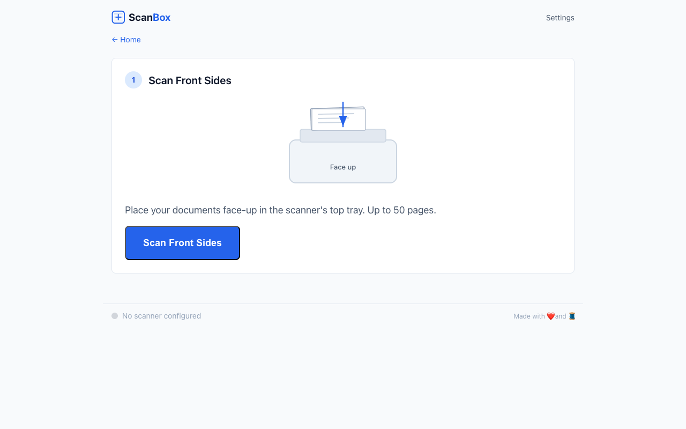
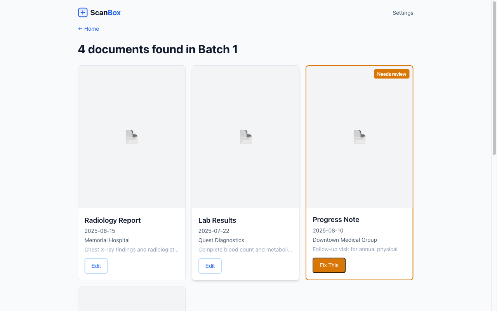
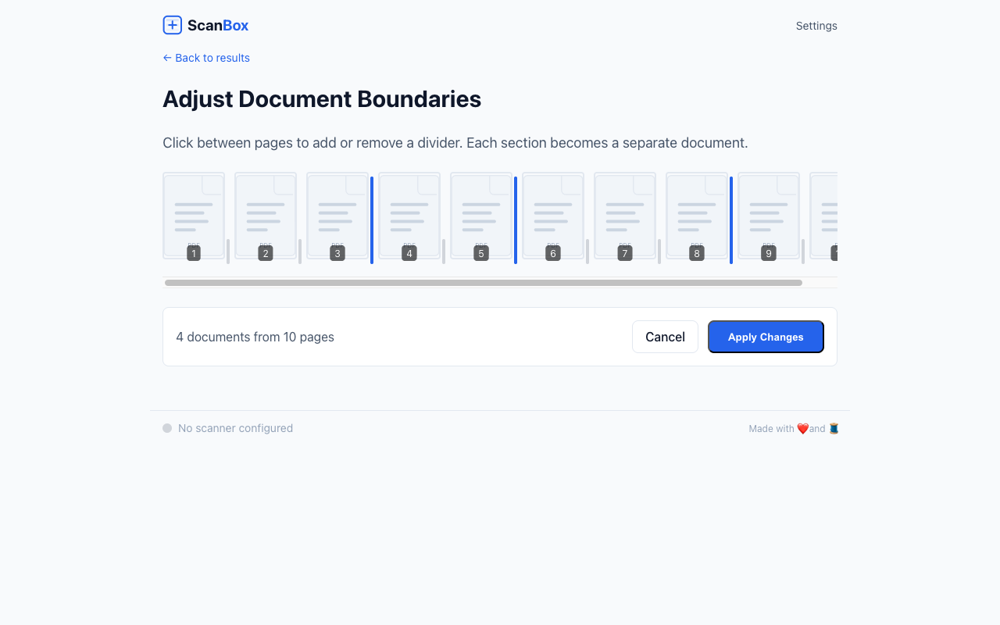
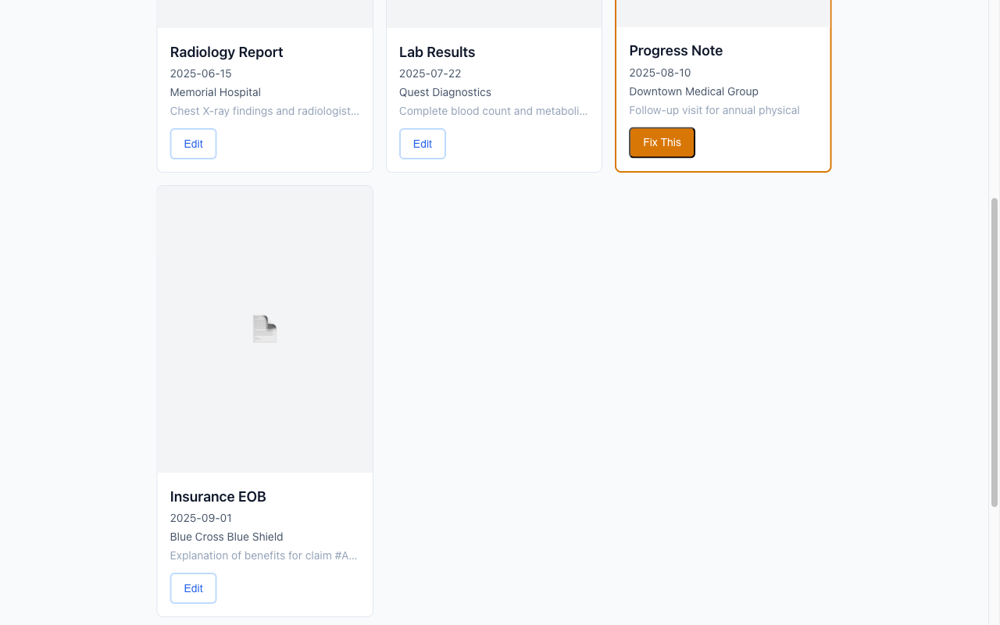
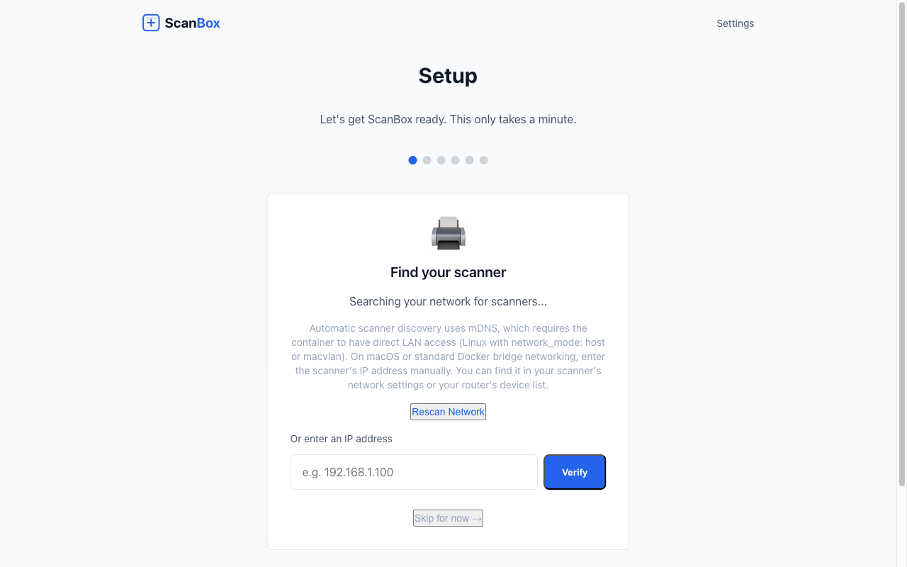
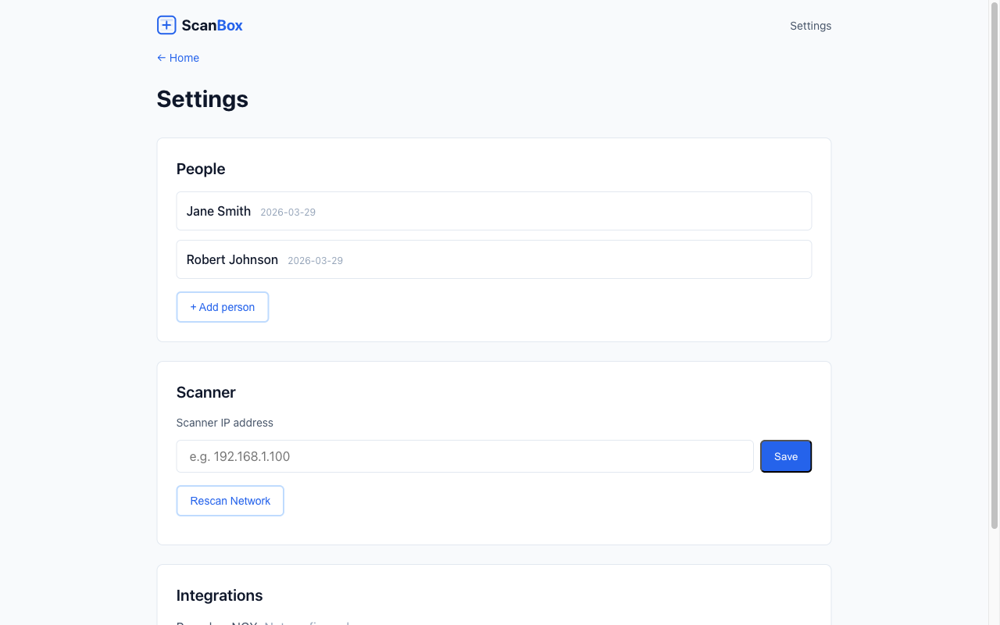

<div align="center">


### Scan, split, and organize stacks of documents — from your browser, your AI agent, or a script.

[](https://github.com/jflammia/scanbox/actions/workflows/ci.yml)
[](#)
[](LICENSE)
[](https://www.python.org/downloads/)
[](https://ghcr.io/jflammia/scanbox)
[](https://github.com/jflammia/scanbox/releases)
[](https://github.com/jflammia/scanbox/stargazers)

<a href="https://glama.ai/mcp/servers"></a>

[Quick Start](#quick-start) · [Features](#features) · [Screenshots](#screenshots) · [Documentation](#documentation) · [API](#api) · [MCP](#mcp-integration) · [Contributing](#contributing)

</div>

---

## What Is ScanBox?

ScanBox is a self-hosted web app that turns a network scanner into a hands-free document digitization station. Load paper, click scan (or tell your AI agent to), and ScanBox handles the rest — interleaving duplex pages, removing blanks, OCR, AI-powered document splitting, professional naming, and organized filing.

Built for scanning hundreds of medical records, tax documents, or any mixed stack where you don't know where one document ends and the next begins.

> **Privacy first.** Everything runs locally. Only OCR text (not images or PDFs) is sent to the LLM for document splitting. Use Ollama for fully offline operation.

## Screenshots

| Scanning Wizard | Review & Edit | Boundary Editor |
|:---:|:---:|:---:|
|  |  |  |

| Document Cards | Setup Wizard | Settings |
|:---:|:---:|:---:|
|  |  |  |

## Features

- **Automatic duplex scanning** — two-pass ADF scanning with automatic page interleaving
- **Blank page removal** — detects and removes blank pages from scanned stacks
- **OCR** — full-text extraction via ocrmypdf with deskew and rotation correction
- **AI document splitting** — LLM-powered boundary detection for mixed document stacks
- **Professional naming** — generates filenames like `2025-06-15_John-Doe_Radiology-Report_Memorial-Hospital.pdf`
- **Interactive boundary editor** — click between page thumbnails to adjust where documents split
- **Three interfaces** — Web UI, REST API, and MCP server all share the same backend
- **PaperlessNGX integration** — optional upload via REST API with metadata
- **Webhook notifications** — `scan.completed`, `processing.completed`, `save.completed` events
- **Crash-safe pipeline** — checkpointed processing resumes from the last completed stage
- **Multi-arch Docker** — runs on amd64 and arm64 (Raspberry Pi, Apple Silicon)
- **No drivers needed** — talks directly to scanners via eSCL/AirScan protocol
- **Fully offline capable** — use Ollama as the LLM provider for air-gapped environments

## How It Works

```
 1. Load paper ──► 2. Scan fronts ──► 3. Flip & scan backs ──► 4. Automatic processing ──► 5. Review ──► 6. Save
                                                                     │
                                                          Interleave → Remove blanks
                                                          → OCR → AI split → Name
```

1. **Load paper** in your scanner's document feeder
2. **Scan** — from the web UI, an API call, or an AI agent
3. **Flip the stack** if double-sided, scan backs
4. ScanBox **processes everything** automatically:
   - Interleaves front and back pages into correct order
   - Removes blank pages
   - OCR — extracts all text
   - AI splits the stack into individual documents
   - Names each file professionally with dates, types, and facilities
5. **Review** — fix anything the AI got wrong (boundaries, names, metadata)
6. **Save** — organized PDFs to your output folder, optionally uploaded to PaperlessNGX

## Quick Start

```bash
git clone https://github.com/jflammia/scanbox.git
cd scanbox
cp .env.example .env    # set SCANNER_IP and LLM provider
docker compose up       # http://localhost:8090
```

The setup wizard walks you through connecting your scanner and LLM on first run.

### Docker Compose

```yaml
services:
  scanbox:
    image: ghcr.io/jflammia/scanbox:latest
    ports:
      - "8090:8090"
    env_file:
      - .env
    volumes:
      - scanbox-data:/app/data
      - ./output:/output
    restart: unless-stopped

volumes:
  scanbox-data:
```

### From Source

```bash
python -m venv .venv && source .venv/bin/activate
pip install -e ".[dev]"
brew install tesseract poppler ghostscript   # macOS
uvicorn scanbox.main:app --port 8090
```

## Configuration

All settings via environment variables in `.env`:

| Variable | Required | Description |
|----------|----------|-------------|
| `SCANNER_IP` | Yes | IP address of your eSCL/AirScan scanner |
| `LLM_PROVIDER` | Yes | `anthropic`, `openai`, or `ollama` |
| `ANTHROPIC_API_KEY` | If Anthropic | API key for Claude |
| `OPENAI_API_KEY` | If OpenAI | API key for GPT |
| `OLLAMA_URL` | If Ollama | Server URL (default: `http://localhost:11434`) |
| `LLM_MODEL` | No | Override default model for your provider |
| `OUTPUT_DIR` | No | Output folder (default: `./output`) |
| `PAPERLESS_URL` | No | PaperlessNGX instance URL |
| `PAPERLESS_API_TOKEN` | No | PaperlessNGX API token |
| `SCANBOX_API_KEY` | No | Bearer token auth (off by default for local use) |
| `MCP_ENABLED` | No | Enable MCP server at `/mcp` |
| `WEBHOOK_URL` | No | URL for event notifications |
| `WEBHOOK_SECRET` | No | HMAC-SHA256 secret for webhook signatures |

See [`.env.example`](.env.example) for a complete template.

## Three Interfaces, One Engine

| Interface | For | How |
|-----------|-----|-----|
| **REST API** | Scripts, automation, external tools | Full CRUD at `/api/*`. OpenAPI docs at `/api/docs` |
| **MCP Server** | AI agents (Claude, etc.) | 20 native tools at `/mcp`. Enable with `MCP_ENABLED=true` |
| **Web UI** | Humans | Wizard-guided scanning at `http://localhost:8090` |

All three share the same backend. Anything you can do in the browser, you can do from curl or Claude.

## API

```bash
# Create a person and session
curl -X POST localhost:8090/api/persons -d '{"display_name": "John Doe"}'
curl -X POST localhost:8090/api/sessions -d '{"person_id": "john-doe"}'

# Scan
curl -X POST localhost:8090/api/batches/{id}/scan/fronts

# Review results
curl localhost:8090/api/batches/{id}/documents

# Save
curl -X POST localhost:8090/api/batches/{id}/save
```

Interactive docs at `http://localhost:8090/api/docs`. Full reference: [`docs/api-spec.md`](docs/api-spec.md).

## MCP Integration

ScanBox exposes a [Model Context Protocol](https://modelcontextprotocol.io) server so AI agents can drive the full scanning workflow through native tool calls.

**20 tools** including `scanbox_scan_fronts`, `scanbox_list_documents`, `scanbox_update_document`, `scanbox_diagnose_system`, and more. Plus 2 resources and 4 prompts.

Add to your AI agent config:

```json
{
  "mcpServers": {
    "scanbox": {
      "command": "docker",
      "args": ["exec", "-i", "scanbox", "python", "-m", "scanbox.mcp"],
      "env": { "MCP_ENABLED": "true" }
    }
  }
}
```

Full reference: [`docs/mcp-server.md`](docs/mcp-server.md).

## Output Structure

```
output/
├── archive/                     # Raw scan backup
│   └── john-doe/2026-03-28/
│       └── batch-001-combined.pdf
└── medical-records/             # Organized for sharing
    └── John_Doe/
        ├── Index.csv
        ├── Radiology Reports/
        │   └── 2025-06-15_John-Doe_Radiology-Report_Memorial-Hospital.pdf
        ├── Lab Results/
        └── ...
```

## Architecture

```
┌──────────┬──────────┬──────────┐
│  Web UI  │ AI Agent │ Scripts  │
│ (htmx)   │ (MCP)    │ (curl)   │
└────┬─────┴────┬─────┴────┬─────┘
     ▼          ▼          ▼
┌─────────────────────────────────┐
│  FastAPI · REST · SSE · MCP     │
├─────────────────────────────────┤
│  Pipeline: Interleave → Blanks  │
│  → OCR → AI Split → Name → Save│
├─────────────────────────────────┤
│  SQLite · Checkpointing         │
└────┬──────────┬──────────┬──────┘
     ▼          ▼          ▼
  Scanner    Output     Paperless
  (eSCL)     (volume)   (optional)
```

**Tech stack:** Python 3.13, FastAPI, htmx, Alpine.js, Tailwind CSS, pikepdf, ocrmypdf, litellm, aiosqlite.

## Scanner Compatibility

ScanBox uses the **eSCL** (Apple AirScan) protocol — an industry standard supported by most modern network scanners. If your scanner works with AirScan or Mopria, it works with ScanBox. No drivers needed.

**Tested with:** HP Color LaserJet MFP M283cdw

## Development

```bash
python -m venv .venv && source .venv/bin/activate
pip install -e ".[dev]"
bash .githooks/setup.sh                          # git hooks + rebase config
brew install tesseract poppler ghostscript        # macOS system deps
python -m tests.generate_fixtures                 # test PDFs

pytest                      # 603 tests, 94% coverage
pytest tests/unit/ -v       # unit tests
pytest tests/integration/   # integration tests
ruff format scanbox/ tests/ # format
ruff check scanbox/ tests/  # lint
```

### Quality Gates

| Layer | What It Checks |
|-------|----------------|
| Pre-commit hook | `ruff check` + `ruff format` |
| Claude Code hooks | Lint + format + full test suite before commit; rebase before push |
| GitHub CI | Lint, test (85% min coverage), Docker build |
| Release pipeline | Test + multi-arch Docker image to GHCR |

## Documentation

| Document | Description |
|----------|-------------|
| [`docs/design.md`](docs/design.md) | Authoritative design spec |
| [`docs/api-spec.md`](docs/api-spec.md) | REST API reference |
| [`docs/mcp-server.md`](docs/mcp-server.md) | MCP server — 20 tools, 2 resources, 4 prompts |
| [`docs/ui-spec.md`](docs/ui-spec.md) | UI components and layouts |
| [`CLAUDE.md`](CLAUDE.md) | AI agent development guide |

## Contributing

Contributions are welcome! Please:

1. Fork the repository
2. Create a feature branch (`git checkout -b feat/my-feature`)
3. Follow the existing code style (`ruff format` + `ruff check`)
4. Write tests for new functionality
5. Ensure all tests pass (`pytest`)
6. Use [conventional commits](https://www.conventionalcommits.org/) (`feat:`, `fix:`, `docs:`, etc.)
7. Open a pull request against `main`

See [`CLAUDE.md`](CLAUDE.md) for detailed development patterns and architecture notes.

## Acknowledgments

Built with [FastAPI](https://fastapi.tiangolo.com/), [htmx](https://htmx.org/), [Alpine.js](https://alpinejs.dev/), [Tailwind CSS](https://tailwindcss.com/), [pikepdf](https://pikepdf.readthedocs.io/), [ocrmypdf](https://ocrmypdf.readthedocs.io/), and [litellm](https://docs.litellm.ai/).

## License

[MIT](LICENSE) &copy; 2026 Justin Flammia
